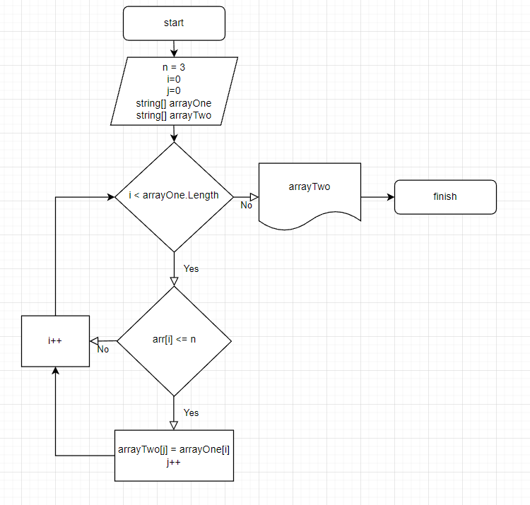

# Итоговая работа

## Задача:
Написать программу, которая из имеющегося массива строк формирует новый массив из строк, длина которых меньше, либо равна 3 символам. Первоначальный массив можно ввести с клавиатуры, либо задать на старте выполнения алгоритма. При решении не рекомендуется пользоваться коллекциями, лучше обойтись исключительно массивами.

**Примеры:** *[“Hello”, “2”, “world”, “:-)”] → [“2”, “:-)”]*

## Алгоритм решения:
1. Создали строковый массив.
2. Создали метод, заполняющий массив (*FillArray*), заполняющий моссив значениями. введенными пользователем.
3. Создали метод вывода заполненного массивна поэлементно на экран (*PrintArray*)
4. Создали метод, определяющий длину нового массиива (*GetSizeOfSecondArray*).
5. Создали условие окончания решения, если размер второго массива равен нулю
6. Создали метод, переносящий опредленные по условию задания элеменыт из изначального массива в новый (*TransferElements*).
7. Вывели на экран нвоый массив.

# Дополнительная информация
Добавили блок-схему алгоритма решения задачи.
